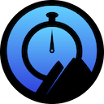

# `RiVal.T` (Rift Valley Timer)

## BASIC ARCHITECTURE

## LICENSE

> NOTE: The app code is not licensed for re-use!
> It is "source-available," **NOT** open-source! It does, however, depend on several true, open-source packages (listed below).
> We are not soliciting pull requests or patches. However, if you have a request or an issue, [feel free to contact us.](https://riftvalleysoftware.com/)

## DEPENDENCIES

This project depends upon:

- [RVS Basic GCD Timer](https://github.com/RiftValleySoftware/RVS_BasicGCDTimer)
- [RVS Checkbox](https://github.com/RiftValleySoftware/RVS_Checkbox)
- [RVS Generic Swift Toolbox](https://github.com/RiftValleySoftware/RVS_Generic_Swift_Toolbox)
- [RVS Persistent Prefs](https://github.com/RiftValleySoftware/RVS_PersistentPrefs)
- [RVS Retro LED Display](https://github.com/RiftValleySoftware/RVS_RetroLEDDisplay)
- [RVS UIKit Toolbox](https://github.com/RiftValleySoftware/RVS_UIKit_Toolbox)
 
## MORE INFORMATION:

For more complete instructions, and information about authorship, support, and privacy, visit https://riftvalleysoftware.com/rival-t/
