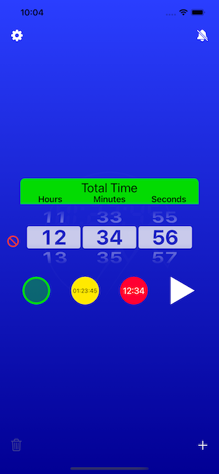
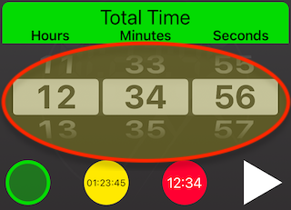
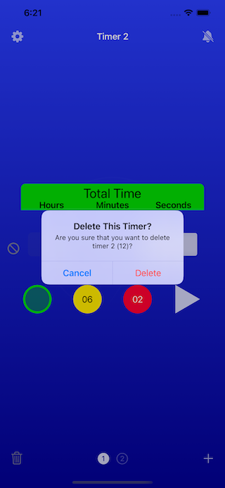
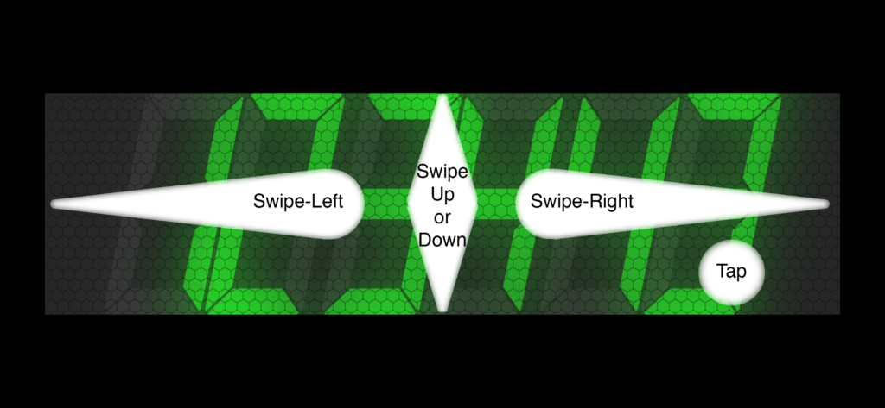

# ``AmbiaMara``

AmbiaMara is the ultimate countdown timer!

It will count down, from a preset time, in intervals of one second.

## OVERVIEW:

The app is a native Swift app, designed explicitly for public speakers, or events, where speakers need to be aware of time constraints.

When running, its display takes over the entire screen of the device, so it is quite visible; even across a large room, while displayed on a small screen.

It has a "retro" digital display mode, reminiscent of [the old-fashioned "vacuum fluorescent" digital displays](https://www.explainthatstuff.com/how-vacuum-fluorescent-displays-work.html)

[Here is the main documentation page for the app](https://riftvalleysoftware.com/work/ios-apps/ambiamara/)

## TIMER MODES:

|Figure 1: Total Time|Figure 2: Warning Time|Figure 3: Final Countdown Time|
|:----:|:----:|:----:|
||||

Each timer has three possible modes, that occur at different times:

    •   Total Time
This is the entire time the timer counts down. It is indicated by a green color.

    •   Warning Time
This threshold, when crossed, causes the timer to turn yellow, indicating that time is running out.

    •   Final Countdown Time
This is when the timer is about to alarm. The timer turns red.

Each timer can be set to have these thresholds, which are reflected in the running timer. You can also choose to have no thresholds.

As each threshold is crossed, the screen flashes briefly. On devices that support haptics, you may feel a slight "twitch."

## RUNNING MODES:
|Figure 4: Digital Mode|Figure 5: Podium Mode|
|:----:|:----:|
|||

It has two running modes:

    •   Digital (numbers only)
The timer display has the appearance of an old-fashioned "LED display."

    •   Podium ("traffic lights")
The timer displays three simple circles that light up, one by one, as the timer progresses. It was specifically designed to reduce distraction.

The display is designed to take up as much space as possible, on the screen.

The mode is chosen in the Settings popover, which is accessed via the "Gear" button, in the top, left of the screen.

|Figure 6: The Settings Popover (Mode Switch On Bottom)|
|:----:|
||

At the end of the timer period, the timer goes into "Alarm Mode," where an audible alarm may sound, the phone may vibrate, and the screen flashes red.

## SETTING THE TIMER:

|Figure 7: The Time Set Picker|
|:----:|
||

Use the picker in the main screen to set the timer initial (Start) time, along with the Warning and Final thresholds. The three buttons below the picker select which threshold is being set.

NOTE: The Warning and/or Final times must be at least one second less than the Start (Total) time.

You can select between a set of sounds that the device will play, along with vibration (on devices that support vibration). This is done, via the Alarm Setting Popover (accessed by the "Bell" button, in the top, right corner of the screen). The sound and vibration settings apply to all timers (if there are multiple timers).

|Figure 8: The Alarm Set Popover|
|:----:|
||

### SELECTING ALARM SOUNDS AND VIBRATION:

If you select the Set Alarm button (the "Bell" button, at the top right of the screen), a popover appears, where you can choose to play a sound, and/or vibrate, when the timer ends a countdown (NOTE: vibrate is only supported on iPhones). If you select a sound, you can test it, using the "Speaker" button, next to the sound picker.

## MULTIPLE TIMERS:

You can have a minimum of one (1) timer, and a maximum of seven (7) timers.

It is possible to "cascade" between these timers, with one timer following another.

### ADDING AND REMOVING TIMERS:

|Figure 9: Adding A New Timer|Figure 10: Deleting A Timer|Figure 11: Delete Confirmation|
|:----:|:----:|:----:|
||||

Use the toolbar, on the bottom of the screen, to add, remove, and select timers.

Add timers by touching the "╋" on the right side of the toolbar, and delete timers, by selecting the trash can icon, on the left side of the toolbar.

You can choose which timer is being set, by selecting a numbered timer button in the toolbar, or by swiping left and right, in the screen.

## OPERATION:

You start the timer by selecting the "Play" button, which is the white triangle, to the right of the Final threshold button, under the time set picker.

|Figure 12: Paused Mode (At Start)|Figure 13: Paused Mode (After Running)|
|:----:|:----:|
|||

|Figure 14: Running Mode (With Initial Green “Flash”)|
|:----:|
||

It is possible to have the timer start immediately, or in Paused mode (Paused mode is indicated by a light blue digital color, or dark "traffic lights"). Choose this, in the Settings Popover.

If the timer is running, the digital display will be green (Start), yellow (Warning), or red (Final, or alarming).

|Figure 15: Start Time|Figure 16: Warning Time|Figure 17: Final Time|
|:----:|:----:|:----:|
||||
||||

When the timer is complete, it begins "alarming," where the screen flashes red, the phone may (or may not) vibrate, and any sound that you choose is played repeatedly.

You can choose to have a toolbar displayed along the bottom of the running timer, or use swipe and tap gestures to control it (without the toolbar).

|Figure 18: Toolbar Mode|Figure 19: Gesture Mode|
|:----:|:----:|
|||

|Figure 20: Toolbar (When Timer is Paused)|
|:----:|
||

|Figure 21: Toolbar (When Timer is Running)|
|:----:|
||

### TOOLBAR MODE (TOOLBAR IS DISPLAYED):

If the toolbar is displayed, use the buttons in the toolbar to control the running timer. Taps and gestures are not used.

NOTE: The toolbar may "auto-hide" in this mode. If it is hidden, tapping in the display will show the toolbar, but will have no effect on the timer.

|Figure 22: The Stop Button|Figure 23: The Play Button|Figure 24: The Pause Button|
|:----:|:----:|:----:|
||||

    •   The Stop Button (square)
This will always stop the timer, and return you to the timer setting screen.

    •   The Play Button (single triangle)/Pause Button (double bars)
This starts the timer, if the timer is paused. If the timer is running, the same button will become a Pause button (indicated by two vertical bars), and selecting it will pause the timer at the current time.

|Figure 25: The Fast Forward Button|Figure 26: The Next Timer Button|Figure 27: The Rewind Button|Figure 28: The Previous Timer Button|
|:----:|:----:|:----:|:----:|
|||||

    •   The Fast Forward Button (double arrow, pointing to the right)/Next Timer Button (circle, with a number in it)
This button will send a paused (or running) timer directly to Alarm Mode. If there is more than one timer, you can use the same button to select the next timer (in which case, the double arrows are replaced by a timer number, in a circle).

    •   The Rewind Button (double arrow, pointing to the left)/Previous Timer Button (circle, with a number in it)
This will cause the timer to return to its starting time, and pause (if it was running). If there is more than one timer, you can use the same button to select the previous timer (in which case, the double arrows are replaced by a timer number, in a circle).

### AUTO-HIDE

|Figure 29: The Auto-Hide Setting|
|:----:|
||

You can choose to have the toolbar "auto-hide," in the Settings Popover. If you choose this, then the toolbar disappears, if there has been no interaction with the timer (touching the screen, or selecting a toolbar item). Touching the screen brings it back.

The toolbar does not auto-hide, if the timer is paused, or is alarming.

### GESTURE MODE (TOOLBAR IS NOT DISLAYED):

|Figure 30: Gestures|
|:----:|
||

If the toolbar is not displayed, you must rely on gestures to control the timer.

    •   Tap (Timer is paused)
The timer starts (or continues) counting down.

    •   Tap (Timer is running)
The timer pauses at the current countdown time.

    •   Swipe Left (Timer is running, or is paused in mid-countdown)
This causes the timer to "reset." This means that it sets the time back to the beginning, but pauses.

    •   Swipe Left (Timer is paused, at the start)
This causes the previous timer to be selected, if there are multiple timers. If there is only one timer, nothing happens.

    •   Swipe Right (Timer is running, or is paused in mid-countdown)
This causes the timer to go directly to Alarm Mode.

    •   Swipe Right (Timer is paused, at the start)
This causes the following timer to be selected, if there are multiple timers. If there is only one timer, nothing happens.

    •   Swipe Up or Down (At any time)
Stop the timer, and return to the setting screen.

### MAC VERSION KEYBOARD NAVIGATION:

In the Mac (Catalyst) version of the app, it is possible to use the keyboard to control the app:

    •   Space Bar
If the space bar is hit, a paused timer will start (or continue), or a running timer will pause.

    •   Left Arrow (Timer is running, or is paused in mid-countdown)
This causes the timer to "reset." This means that it sets the time back to the beginning, but pauses.

    •   Left Arrow (Timer is paused, at the start)
This causes the previous timer to be selected, if there are multiple timers. If there is only one timer, nothing happens.

    •   Right Arrow (Timer is running, or is paused in mid-countdown)
This causes the timer to go directly to Alarm Mode.

    •   Right Arrow (Timer is paused, at the start)
This causes the following timer to be selected, if there are multiple timers. If there is only one timer, nothing happens.

    •   Escape (ESC) Key (At any time)
Stop the timer, and return to the setting screen.

MORE INFORMATION:

For more complete instructions, and information about authorship, support, and privacy, visit https://riftvalleysoftware.com/work/ios-apps/ambiamara/
