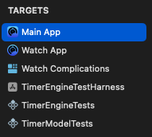

# `RiVal.T` (Rift Valley Timer)

## BASIC ARCHITECTURE

### SUPPORTED DESTINATION SYSTEMS

The app is designed to provide executable apps for the iOS/iPadOS App Stores (as native apps), and the Mac App Store (as a [Mac Catalyst](https://developer.apple.com/documentation/uikit/mac-catalyst) executable).

iOS and iPadOS require version 17 or above, and the Mac requires Ventura (Mac OS 13) or above.

The Watch app will not be supplied with the initial 3.0.1 release, but will be supplied in the 3.1.0 release, and will require WatchOS 10 or above.

### [THE MODEL](https://github.com/RiftValleySoftware/ambiamara/tree/master/Sources/Shared/Sources/Model)

The core of the app, is the [``TimerEngine``](https://github.com/RiftValleySoftware/ambiamara/blob/master/Sources/Shared/Sources/Model/TimerEngine.swift) class. This provides the basic timer operation and control. Its domain is just the "ticker," for a single timer. It doesn't define a lot of the app behavior.

Wrapping that, is the [``TimerModel``](https://github.com/RiftValleySoftware/ambiamara/blob/master/Sources/Shared/Sources/Model/TimerModel.swift) class, which adds app behavior to the engine, like multiple timers, and timer groups. Most of the app behavior comes from this class.

Even though the initial release of the 3.0 version does not include a companion Watch app, one is on the way, so the model is wrapped in the [``RiValT_WatchDelegate``](https://github.com/RiftValleySoftware/ambiamara/blob/master/Sources/Shared/Sources/Model/RiValT_WatchDelegate.swift) class, which manages communication between the Watch and the iPhone.

Each of the above classes is shared between the [`UIKit`](https://developer.apple.com/documentation/uikit) main app (iPhone, iPad, and Mac), and the [`SwiftUI`](https://developer.apple.com/xcode/swiftui/) Watch app.

### THE TARGETS

#### [The Main App Target](https://github.com/RiftValleySoftware/ambiamara/tree/master/Sources/MainApp)

The main application target is implemented, using Apple's [`UIKit`](https://developer.apple.com/documentation/uikit) application framework. This target is used to build the iOS release (for the iOS App Store), as well as the [Mac Catalyst](https://developer.apple.com/documentation/uikit/mac-catalyst) release (for the Mac App Store).

#### The [Watch App](https://github.com/RiftValleySoftware/ambiamara/tree/master/Sources/WatchApp) and [Watch Complication](https://github.com/RiftValleySoftware/ambiamara/tree/master/Sources/WatchComplications) Targets

The Watch application target is implemented, using Apple's [`SwiftUI`](https://developer.apple.com/xcode/swiftui/) application framework (as is the Watch Complication target). The Watch app will be supplied as embedded in the iOS app (it will not be supplied as a standalone app). It will be designed as a "remote control" for the iOS app.

#### [The Test Targets](https://github.com/RiftValleySoftware/ambiamara/tree/master/Tests)

There is one target, implementing [a SwiftUI test harness for the ``TimerEngine``](https://github.com/RiftValleySoftware/ambiamara/tree/master/Tests/TimerEngineTestHarness), and two targets, devoted to unit testing the [``TimerEngine``](https://github.com/RiftValleySoftware/ambiamara/tree/master/Tests/TimerEngineTests) and [``TimerModel``](https://github.com/RiftValleySoftware/ambiamara/tree/master/Tests/TimerModelTests). These are only used for testing. The unit tests are not "complete" (providing 100% code coverage), but they do test the crucial functionality of each model subsystem.

## LICENSE

> NOTE: The app code is not licensed for re-use!
> It is "source-available," **NOT** open-source! It does, however, depend on several true, open-source packages (listed below).
> We are not soliciting pull requests or patches. However, if you have a request or an issue, [feel free to contact us.](https://riftvalleysoftware.com/)

## DEPENDENCIES

This project depends upon:

- [RVS Basic GCD Timer](https://github.com/RiftValleySoftware/RVS_BasicGCDTimer)
- [RVS Checkbox](https://github.com/RiftValleySoftware/RVS_Checkbox)
- [RVS Generic Swift Toolbox](https://github.com/RiftValleySoftware/RVS_Generic_Swift_Toolbox)
- [RVS Persistent Prefs](https://github.com/RiftValleySoftware/RVS_PersistentPrefs)
- [RVS Retro LED Display](https://github.com/RiftValleySoftware/RVS_RetroLEDDisplay)
- [RVS UIKit Toolbox](https://github.com/RiftValleySoftware/RVS_UIKit_Toolbox)
 
## MORE INFORMATION:

For more complete instructions, and information about authorship, support, and privacy, visit https://riftvalleysoftware.com/rival-t/
